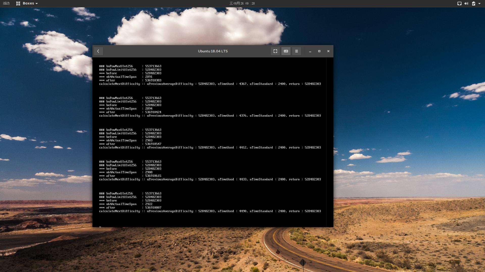
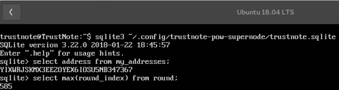
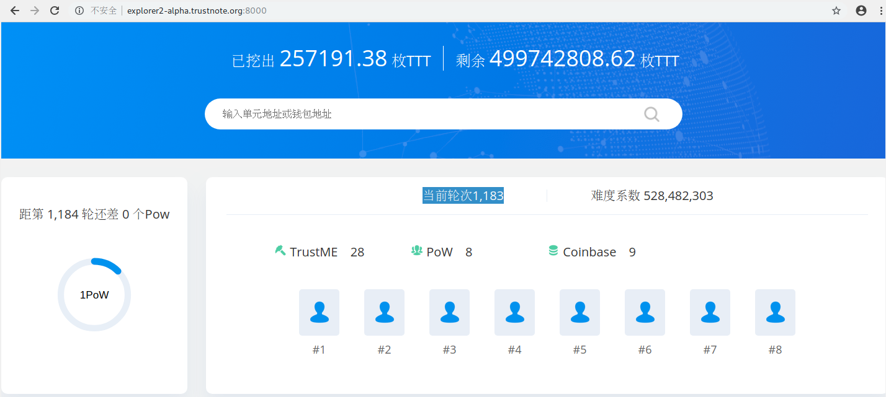

# TrustNote 挖矿简易教程 （Ubuntu1804LTS Server 版）

介绍

>该项目在 Ubuntu1804LTS Server 下经过测试可安装运行，其它系统会出现一些无法安装的问题，该bug请社区开发者解决，我们会给出相应激励。

1. 克隆项目

```
git clone https://github.com/trustnote/trustnote-pow-supernode.git
```

2. 安装依赖


大陆用户，在安装依赖前可设置淘宝源加快安装速度（海外用户可掠过设置淘宝源）：

```
npm config set registry https://registry.npm.taobao.org
```

```
cd trustnote-pow-supernode
sudo npm install
```

3. 开始挖矿

```
node start.js
```

之后会有2次需要输入的命令行交互，可以一路回车下去，挖矿的时候会出现这样的界面：




4. 查看挖矿状态与挖矿地址

因为是全节点，所以需要同步一些数据，这需要花费一些时间。


连接数据库

```
sqlite3 ~/.config/trustnote-pow-supernode/trustnote.sqlite
```

得到自己的挖矿收益地址
```
sqlite> select address from my_addresses;
```

查看节点数据是否同步完成
```
sqlite>select max(round_index) from round;
```



这时去浏览器 http://explorer2-alpha.trustnote.org:8000/ 查看当前轮次。



可以看到框选处，此刻当前轮次是1183。接下来输入sqlite3命令，查询同步到的轮次：

如果得到的轮次和浏览器的相同，则说明已经开始挖矿了。


5. 查看挖到多少TTT

登录 http://explorer2-alpha.trustnote.org:8000/  输入自己的挖矿钱包地址，查看余额即可。


### 附件：常见错误信息

node-gyp rebuild error

```
Install fail! Error: Run "sh -c node-gyp rebuild" error, exit code 1
```

这类错误出现在其他linux系统中，经过测试 Ubuntu1804LTS Server 是没问题的。
