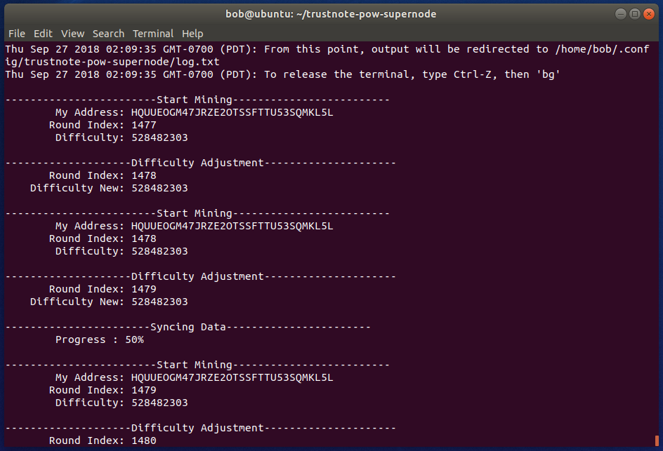
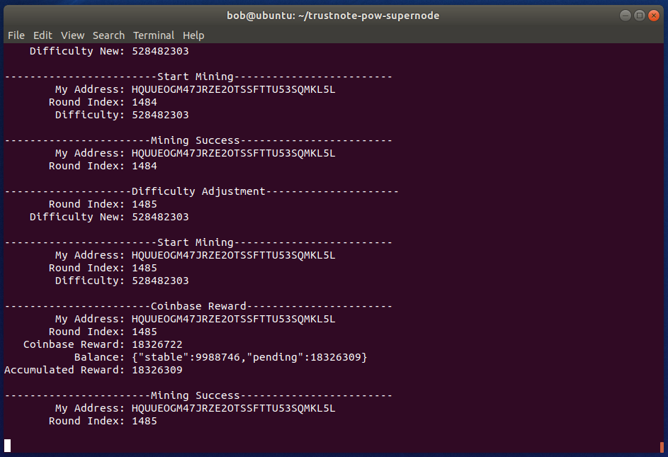

# How to Mine $TTT-test on the TrustNote2 Testnet - Alpha Release on Ubuntu Linux

So, you’ve heard about [TrustNote](https://trustnote.org/), the minable Public DAG ledger, and you’re ready to get your hands dirty with some of the latest cutting-edge cryptocurrencies such as [$TTT](https://coinmarketcap.com/currencies/trustnote/). In addition to buying and trading $TTT, you can “mine” for them. Mining $TTT on TrustNote is actually the process of a fair and trustable witness node selection, for which the miners are rewarded. This tutorial will show you how to get started mining TTT-Test Notes on the TrustNote 2.0 Alpha testnet using a PC running Ubuntu 18.04.1. The process may very slightly between different versions and flavors of Linux, but you'll get the idea of what those differences may be as you follow along.

## Requirements for this tutorial
**Ubuntu 18.04.1** - [Ubuntu 18.04.1](http://releases.ubuntu.com/18.04/)
This guide assumes that you are using Ubuntu 18.04.1 Server. Before you begin, you should have a non-root user account with sudo privileges set up on your system. If you simply downloaded the ISO and did a default install, you're good-to-go.


**Install prerequisite supporting software**

Enable and refresh the Universe repository where the prerequisite software packages are be found:
```
sudo add-apt-repository universe
```

Might as well install any updates:
```
sudo apt update && sudo apt upgrade
```

Now let's install the nodejs, npm, and sqlite3 software packages:
```
sudo apt install nodejs npm sqlite3
```


## Setup Your Super Node

Clone from the source using git:
```
git clone https://github.com/trustnote/trustnote-pow-supernode.git
```

Install the code using npm:
```
cd trustnote-pow-supernode
npm install
```

Start the mining service to complete the set-up:
```
node start.js
```

You can simply press Enter to accept the defaults when you are prompted for input, or give your miner a cool name if you wish. The first time this is run, the software will generate the keys for the internal wallet where your mining rewards will be stored. If you wish to make a backup of the wallet and configuration, make a copy of of the .json files and store them in a safe place. You can use the mnemonic phrase words to  If you simply want to see and save your mnemonic phrase, type the following to dump them as well as your private key(s) to the screen:
```
cat ~/.config/trustnote-pow-supernode/keys.json
```

Start the mining service once more on your super node to start syncing the consensus data:
```
node start.js
```

Before mining can be started, all previous consensus data will need to be be synchronized locally to your supernode. This can be very CPU intensive as it validates the data, and may take upwards of 12 hours to complete depending on your computation speed and internet connection. In my case, it took about 6 hours to get up-to-date.

As it is syncing, you will see information scroll up in the terminal window. You can see your public address as well as the Round Index, which can give you a rough estimate on which Consensus Round you are currently on. 

If you would like to send the sync process to the background so you can do other things, type:
```
CTRL+Z
bg
```
This will free up the terminal, however output will still be dumped to the terminal. This is harmless and will not interfere with whatever else you are doing. 


## Check Super Node’s Data Synchronization Status

If you open a separate terminal window, or SSH session, and wish to check the status, you can query the SQL database directly to get some info, such as current consensus round and wallet address.

Wallet public address:
```
sqlite3 ~/.config/trustnote-pow-supernode/trustnote.sqlite "select address from my_addresses;"
```

Current consensus round:
```
sqlite3 ~/.config/trustnote-pow-supernode/trustnote.sqlite "select max(round_index) from round;"
```

You can compare your current round number with the number of consensus rounds listed on the TrustNote2 [testnet explorer](http://explorer2-alpha.trustnote.org:8000/). This can give you an idea on how long it may take to synchronize the rest of the data. Again, depending on your CPU and connection speed, it may take 12 hours or more to complete the sync.

Note: it may take a few minutes before the number of current consensus round showing up on the web page after the testnet explorer is opened.


** Congratuations, yur mining rig is up and running on the TrustNote 2.0 Testnet


## How to Get TTT Test Notes
To start with mining TTT-Test Notes you will need to have a small amount of TTT-Test Notes to pay for your initial transactions on the TrustNote 2.0 testnet.

Email bob(at)trustnote.org, or ping @andrewfisher_ttt on telegram, and send your super node’s wallet address and we will gladly to send you 10 MN (million notes) TTT-Test Notes. That is more than enough to cover the small initial transfer fee for you to start mining.

## Check My Mining Status
Once the rounds of data synchronized to your super node is the same as the number of current consensus round, you will see messages like below.

<p align="center">
  
</p>


## Check How Many TTT Test Notes I Have Mined
To check how many TTT Test Notes you have mined, open the TrustNote2 [testnet explorer](http://explorer2-alpha.trustnote.org:8000/), enter your Super Node’s wallet address in the search field and press the search button, you will see the changes of your wallet balance in line with the coinbase rewards you received and the transaction costs you have spent.

The message below shows the Coinbase rewards your super nodes receive during the mining process.

<p align="center">
  
</p>

## What’s Next?
Congratulations for your success on mining TTT-Test Notes! I hope you enjoy it and find it as exciting as I do! In the coming weeks, we’ll release more tools and tutorials, so any comments, questions, or concerns are welcomed!

Note this is just the very first release in our renewed TrustNote 2.0 [roadmap](https://github.com/TrustNoteDocs/community-committee/blob/master/ROADMAP.md), and is sure to have rough edges and room for improvement. It is still far from completion or perfection. To make it better, we welcome you, the community members, to join us to test, develop, and discuss new features as we moving forward. 

From time to time, as a community, we will evaluate the contributions made by every contributors. Volunteers that have provided significant contribution will be recognized for their outstanding work, and will be rewarded with Mainnet $TTT tokens as appreciation (not payment) for the quality of the work submitted. Please reach me on bob(at)trustnote.org if you want to help.

If you've gotten this far, then you are a true TTT fan. Thanks for taking the time to participate in the early testing of the new platform, and if you have any questions please feel free to comment below or contact me via email.
